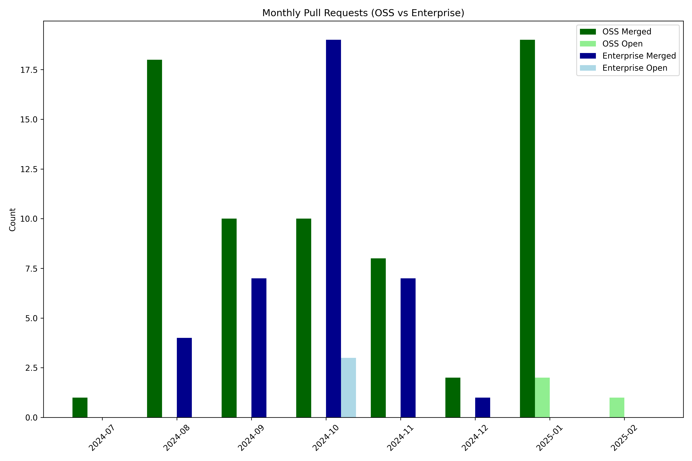

## 2025-01

### Merged Pull Requests

- [#217](https://github.com/daytonaio/docs/pull/217): docs: add wsl2 ssh client troubleshooting setup (merged at: 2025-01-07T07:49:23Z)
- [#216](https://github.com/daytonaio/docs/pull/216): docs: add azure provider service principal note (merged at: 2025-01-07T07:50:47Z)
- [#222](https://github.com/daytonaio/docs/pull/222): docs: sdk (merged at: 2025-01-07T17:03:41Z)
- [#218](https://github.com/daytonaio/docs/pull/218): docs: add samples (merged at: 2025-01-09T08:11:43Z)
- [#215](https://github.com/daytonaio/docs/pull/215): docs: add container registries (merged at: 2025-01-10T09:36:28Z)
- [#232](https://github.com/daytonaio/docs/pull/232): docs: add vscode insiders, vscodium, & windsurf ide (merged at: 2025-01-13T08:29:29Z)
- [#233](https://github.com/daytonaio/docs/pull/233): docs: add sdk section to readme (merged at: 2025-01-13T08:49:25Z)
- [#234](https://github.com/daytonaio/docs/pull/234): docs: add api keys section (merged at: 2025-01-13T16:13:01Z)
- [#214](https://github.com/daytonaio/docs/pull/214): docs: add architecture diagram (merged at: 2025-01-13T16:51:04Z)
- [#205](https://github.com/daytonaio/docs/pull/205): docs: add workspace toolbox (merged at: 2025-01-14T07:44:16Z)
- [#227](https://github.com/daytonaio/docs/pull/227): docs: refactor sdk code snippets & content (merged at: 2025-01-14T07:47:26Z)

## 2024-12

### Merged Pull Requests

- [#209](https://github.com/daytonaio/docs/pull/209): docs: modify installation section side menu (merged at: 2024-12-19T09:42:35Z)
- [#210](https://github.com/daytonaio/docs/pull/210): feat: add search website index (merged at: 2024-12-19T09:42:50Z)

### Open Pull Requests

- [#207](https://github.com/daytonaio/docs/pull/207): docs: refactor workspaces, projects, and targets (created at: 2024-12-17T00:25:33Z)

## 2024-11

### Merged Pull Requests

- [#186](https://github.com/daytonaio/docs/pull/186): docs: tabbify installation section (merged at: 2024-11-07T08:05:53Z)
- [#188](https://github.com/daytonaio/docs/pull/188): docs: add gcp and hetzner providers (merged at: 2024-11-12T09:08:31Z)
- [#178](https://github.com/daytonaio/docs/pull/178): feat: add search functionality (merged at: 2024-11-15T07:58:09Z)
- [#193](https://github.com/daytonaio/docs/pull/193): feat: add update llms(.txt) index (standardize LLM-friendly content) (merged at: 2024-11-19T08:16:44Z)
- [#191](https://github.com/daytonaio/docs/pull/191): docs: add docker extension (merged at: 2024-11-19T08:24:58Z)
- [#197](https://github.com/daytonaio/docs/pull/197): docs: hide search without .env set (merged at: 2024-11-20T06:17:12Z)
- [#198](https://github.com/daytonaio/docs/pull/198): feat: search update (index automation & blog) (merged at: 2024-11-25T11:36:01Z)
- [#199](https://github.com/daytonaio/docs/pull/199): feat: add update search to build script (merged at: 2024-11-29T15:41:01Z)

## 2024-10

### Merged Pull Requests

- [#159](https://github.com/daytonaio/docs/pull/159): docs: add workspace multi-projects (merged at: 2024-10-02T09:37:54Z)
- [#170](https://github.com/daytonaio/docs/pull/170): docs: add git providers update (merged at: 2024-10-14T07:41:35Z)
- [#166](https://github.com/daytonaio/docs/pull/166): docs: add getting-started quick-start sections (merged at: 2024-10-14T07:49:16Z)
- [#165](https://github.com/daytonaio/docs/pull/165): docs(style): green code/blockquote text value (merged at: 2024-10-14T07:49:36Z)
- [#164](https://github.com/daytonaio/docs/pull/164): docs: fix list formatting (merged at: 2024-10-14T07:49:50Z)
- [#172](https://github.com/daytonaio/docs/pull/172): docs: rename references to tools and resources (merged at: 2024-10-15T06:52:36Z)
- [#163](https://github.com/daytonaio/docs/pull/163): docs: builders dev container & modify layout (merged at: 2024-10-15T07:21:29Z)
- [#169](https://github.com/daytonaio/docs/pull/169): docs: update daytona create workspace section (merged at: 2024-10-15T07:23:25Z)
- [#177](https://github.com/daytonaio/docs/pull/177): docs: remove forward --public flag section (merged at: 2024-10-17T06:26:30Z)
- [#181](https://github.com/daytonaio/docs/pull/181): docs: add offerings availability label (merged at: 2024-10-28T08:46:43Z)

## 2024-09

### Merged Pull Requests

- [#128](https://github.com/daytonaio/docs/pull/128): docs: consistent style indentation formatting (merged at: 2024-09-03T07:49:30Z)
- [#141](https://github.com/daytonaio/docs/pull/141): docs: add docker local & remote server requirements (merged at: 2024-09-06T11:12:37Z)
- [#142](https://github.com/daytonaio/docs/pull/142): docs: add workspace samples entry (merged at: 2024-09-06T11:13:41Z)
- [#146](https://github.com/daytonaio/docs/pull/146): docs: add wsl ssh client setup instructions note (merged at: 2024-09-06T11:16:46Z)
- [#140](https://github.com/daytonaio/docs/pull/140): docs: fix broken links & hyperlinks (merged at: 2024-09-09T07:11:58Z)
- [#145](https://github.com/daytonaio/docs/pull/145): docs: add supported git providers note to prebuilds (merged at: 2024-09-11T14:54:35Z)
- [#144](https://github.com/daytonaio/docs/pull/144): docs(style): add prebuilds icon (merged at: 2024-09-11T14:55:20Z)
- [#147](https://github.com/daytonaio/docs/pull/147): docs: update readme (merged at: 2024-09-12T07:39:29Z)
- [#150](https://github.com/daytonaio/docs/pull/150): docs: add jetbrains fleet & jupyter ide (merged at: 2024-09-20T13:09:46Z)
- [#143](https://github.com/daytonaio/docs/pull/143): docs: add cursor ide (merged at: 2024-09-20T15:48:26Z)

## 2024-08

### Merged Pull Requests

- [#96](https://github.com/daytonaio/docs/pull/96): docs: workspaces section textual and visual improvements (merged at: 2024-08-06T07:19:01Z)
- [#104](https://github.com/daytonaio/docs/pull/104): docs: telemetry section textual and visual improvements (merged at: 2024-08-07T07:15:45Z)
- [#100](https://github.com/daytonaio/docs/pull/100): style: remove text code block copy icon (merged at: 2024-08-07T07:25:47Z)
- [#103](https://github.com/daytonaio/docs/pull/103): docs: modify support anchor tag hyperlink (merged at: 2024-08-08T07:39:59Z)
- [#102](https://github.com/daytonaio/docs/pull/102): docs: providers section textual and visual improvements (merged at: 2024-08-08T07:43:03Z)
- [#107](https://github.com/daytonaio/docs/pull/107): docs: footer version reference package.json (merged at: 2024-08-12T07:22:29Z)
- [#101](https://github.com/daytonaio/docs/pull/101): docs: git providers section textual and visual improvements (merged at: 2024-08-12T09:44:09Z)
- [#106](https://github.com/daytonaio/docs/pull/106): docs: add purge manual instructions (merged at: 2024-08-12T11:28:21Z)
- [#113](https://github.com/daytonaio/docs/pull/113): docs: remove prerequisites and procedures notes (merged at: 2024-08-13T09:25:59Z)
- [#105](https://github.com/daytonaio/docs/pull/105): docs: server section textual and visual improvements (merged at: 2024-08-14T08:32:58Z)
- [#111](https://github.com/daytonaio/docs/pull/111): docs: add individual ide process (merged at: 2024-08-14T08:37:16Z)
- [#115](https://github.com/daytonaio/docs/pull/115): docs: add project configurations (merged at: 2024-08-20T07:17:39Z)
- [#119](https://github.com/daytonaio/docs/pull/119): docs: fix incorrect redirect (merged at: 2024-08-21T06:25:42Z)
- [#116](https://github.com/daytonaio/docs/pull/116): docs: getting started onboarding section (merged at: 2024-08-21T10:54:56Z)
- [#120](https://github.com/daytonaio/docs/pull/120): docs: update index with new sections (merged at: 2024-08-27T15:17:54Z)
- [#124](https://github.com/daytonaio/docs/pull/124): docs: add new providers (merged at: 2024-08-30T15:54:50Z)
- [#125](https://github.com/daytonaio/docs/pull/125): docs: add prebuilds (merged at: 2024-08-30T16:08:07Z)
- [#126](https://github.com/daytonaio/docs/pull/126): docs: fix cli reference hyperlink (merged at: 2024-08-30T16:11:22Z)

## 2024-07

### Merged Pull Requests

- [#97](https://github.com/daytonaio/docs/pull/97): fix: minor text whitespace formatting (merged at: 2024-07-31T07:48:10Z)